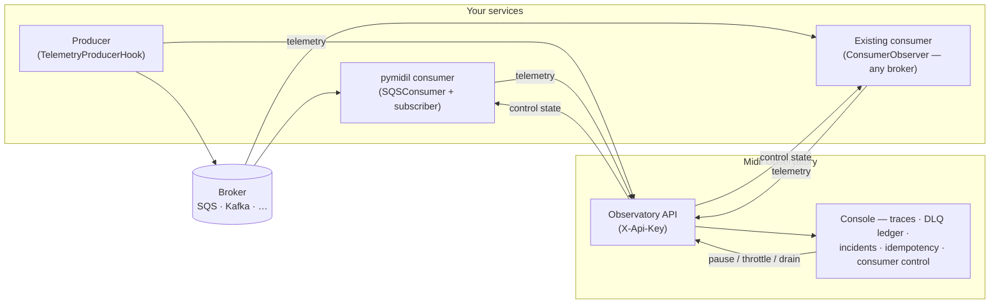

# pymidil

**The Python SDK for [Midil Observatory](https://midil.io) — every event, accounted for.**

Midil is an observability control plane for event-driven systems: it traces each
message from producer to consumer, keeps the dead-letter ledger, and gives your
team the levers — pause, throttle, drain — in one console. `pymidil` is how your
services plug into it: instrument the consumers you already run, or build on the
SDK's event runtime and get telemetry, idempotency, and retry/DLQ semantics
built in.

[](https://pypi.org/project/pymidil/)
[](https://pypi.org/project/pymidil/)
[](LICENSE)

---

## How it fits together



Every observation lands in your organization's isolated tenant, routed by the
API key. From the console you get the end-to-end trace graph (one `OrderPaid`
fanning into four branches, the red leg obvious), the dead-letter ledger grouped
by failure class, incident investigation, idempotency analysis — and live
control over the consumers themselves. Replay of dead-lettered events is on the
roadmap (the console marks it "soon"; nothing in the SDK pretends otherwise).

---

## Install

```bash
pip install pymidil
```

Modular — install only what your service needs:

| Extra | Installs | Use when you need |
|---|---|---|
| `pymidil[auth]` | httpx, pyjwt | HTTP telemetry sink, Cognito auth, JWT verification |
| `pymidil[web]` | fastapi, starlette, uvicorn | REST APIs, middleware, pagination |
| `pymidil[aws]` | aioboto3 | SQS producers/consumers, EventBridge scheduling |
| `pymidil[redis]` | redis | Redis-backed event streaming |
| `pymidil[mongodb]` | pymongo | MongoDB cursor pagination |
| `pymidil[cli]` | click, rich, cookiecutter | Project scaffolding and service launcher |
| `pymidil[full]` | everything | — |

Requires Python 3.12+.

---

## Observe a consumer you already run

Zero refactor: keep your broker client, your loop, your handler. Wrap each
delivery in an observation and Midil gets the outcome, the timing, and the
trace lineage — and you get console control back.

```python
from pymidil.event.observability import ConsumerObserver

observe = ConsumerObserver(
    observatory_url="https://api.midil.io",
    api_key="mo_…",              # issued in the console (org settings → API keys)
    consumer="orders-worker",     # the name the Observatory shows — and controls
    broker="kafka",               # a label; any broker works
)

async for record in kafka_consumer:                    # your existing loop
    if not (await observe.control.get()).state.should_pull:
        continue                                       # paused from the console
    async with observe(record.key, "OrderPlaced", headers=record.headers):
        await handle_order(record)                     # your code, untouched
```

Per delivery, those lines buy: a telemetry envelope (success / retrying /
failed / dlq) identical to what a pymidil-managed consumer emits, wall-clock
processing time, W3C trace continuity from the message headers — the lineage
graph's cross-service edges — and pause/throttle/drain honored straight from
the console. `ProducerObserver` is the emit-side counterpart.

---

## Or build on the event runtime

Subscribers are classes with a lifecycle, not callbacks. Retry-vs-dead-letter
is decided by the exception you raise, idempotency is a policy you attach, and
telemetry is a hook — each concern snaps on independently.

```python
from pymidil.event import (
    EventSubscriber, SQSConsumer, SQSConsumerEventConfig, TelemetryDispatchHook,
)
from pymidil.event.exceptions import RetryableEventError
from pymidil.event.idempotency import IdempotencyPolicy, InMemoryIdempotencyStore
from pymidil.event.observability.sinks.http import HttpTelemetrySink

class OrderSubscriber(EventSubscriber):
    async def handle(self, event) -> None:
        if upstream_busy():
            raise RetryableEventError("throttled")   # → redelivered with backoff
        await process(event)                          # any other error → DLQ

consumer = SQSConsumer(SQSConsumerEventConfig(type="sqs", queue_url=..., dlq_url=...))
consumer.add_hook(TelemetryDispatchHook(
    HttpTelemetrySink("https://api.midil.io", api_key="mo_…"),
    source_service="orders-svc",
    broker="sqs",
))
consumer.use_idempotency(IdempotencyPolicy(InMemoryIdempotencyStore(), key_fn=...))
consumer.subscribe(OrderSubscriber())
```

The [`sqs_fanout` example](examples/event/sqs_fanout/) is the full tour: one
`OrderPaid` fanning out into four services on LocalStack SQS, a deliberately
flaky branch dead-lettering ~30% of the time, and the whole shape visible in
the Observatory's trace graph.

---

## Authentication

Services authenticate to the Observatory with an **API key** (`mo_…`), created
by an organization admin in the console and passed as `api_key=` (sent as
`X-Api-Key`). The key selects your organization — telemetry can only land in
your own tenant — and is scoped to exactly two capabilities: writing telemetry
and reading control state. A leaked key can never touch the console or
management surfaces.

---

## The supporting toolkit

The SDK also ships the service plumbing the event runtime grew out of — usable
on their own:

| Module | What it gives you |
|---|---|
| `pymidil.auth` | Cognito client-credentials auth (outbound) and JWT verification (inbound), behind pluggable interfaces |
| `pymidil.client` | HTTPX-based client with retry, backoff, and auth-header injection |
| `pymidil.web` | `MidilAPI` (FastAPI subclass), auth middleware, cursor/offset pagination, [JSON:API](https://jsonapi.org/) serialization |
| `pymidil.event.scheduler` | One-off and future-dated events via AWS EventBridge |
| `pymidil.logger` | Structured logging with sensitive-data masking |
| `midil` CLI | `midil init` (scaffold a service), `midil launch`, `midil version` |

---

## Examples

Runnable examples live in [`examples/`](examples/) — see the
[examples README](examples/README.md). Start with:

- [`event/sqs_fanout/`](examples/event/sqs_fanout/) — the end-to-end tour:
  fan-out topology, retries, DLQ, idempotency, telemetry, console control.
- [`event/kafka_observer.py`](examples/event/kafka_observer.py) — zero-refactor
  observation of an existing aiokafka consumer.

---

## Design principles

- **Async-first.** Every component is built for `asyncio` — no sync wrappers.
- **Observation is data, control is explicit.** Telemetry describes what
  happened; your consumer only changes behavior where you poll control state.
- **One semantic core.** An observed consumer and a pymidil-managed one emit
  the same envelopes — the Observatory can't tell the difference, by design.
- **Interface-driven.** Sinks, control sources, subscribers, auth providers,
  retry strategies — all swappable abstract bases.
- **Opt-in by default.** Nothing is installed you didn't ask for.

---

## License

Apache 2.0 — see [LICENSE](LICENSE).
Built at [midil.io](https://midil.io).
